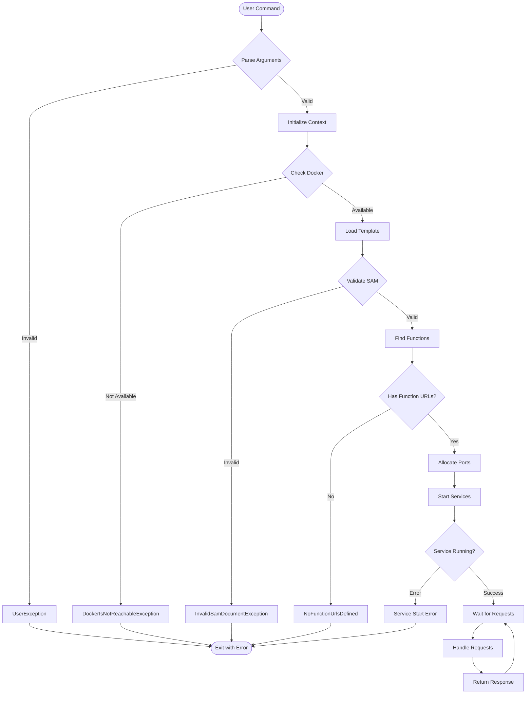

# AWS SAM CLI Architecture Diagrams

## Clean Architecture Overview


## Function URLs Feature Architecture


## Request Processing Flow


## Component Relationships


## Data Flow for Environment Variables

```mermaid
graph TD
    subgraph "Input Sources"
        T[Template Variables]
        J[JSON File<br/>--env-vars]
        S[Shell Environment]
    end
    
    subgraph "Processing"
        EV[EnvironmentVariables Class]
        R[resolve() Method]
        P[Priority Logic]
    end
    
    subgraph "Output"
        D[Docker Container<br/>Environment]
        L[Lambda Function]
    end
    
    T --> EV
    J --> EV
    S --> EV
    
    EV --> R
    R --> P
    
    P -->|1. Override Values<br/>Highest Priority| D
    P -->|2. Shell Values<br/>Medium Priority| D
    P -->|3. Template Values<br/>Lowest Priority| D
    
    D --> L
```

## Testing Architecture


## Deployment Pipeline


## Error Handling Flow



---

## Key Architectural Principles

1. **Separation of Concerns**: Each layer has distinct responsibilities
2. **Dependency Inversion**: High-level modules don't depend on low-level modules
3. **Single Responsibility**: Each class/module has one reason to change
4. **Open/Closed Principle**: Open for extension, closed for modification
5. **Interface Segregation**: Clients shouldn't depend on interfaces they don't use

## Benefits of This Architecture

- **Testability**: Each component can be tested in isolation
- **Maintainability**: Clear boundaries between components
- **Scalability**: Easy to add new features without affecting existing code
- **Flexibility**: Components can be replaced or modified independently
- **Reusability**: Common functionality is abstracted and reusable
