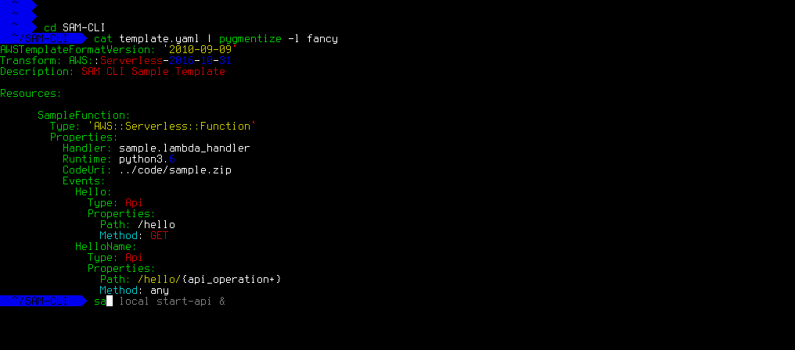

<div style="text-align: center">
  <a href="https://github.com/awslabs/aws-sam-cli" style="text-align: center">
    
  </a>
</div>

# SAM CLI

 **`sam`** is the AWS CLI tool for managing Serverless applications written with [AWS Serverless Application Model (SAM)](https://github.com/awslabs/serverless-application-model). SAM CLI can be used for testing functions locally, start a local API Gateway from a SAM template, validate a SAM template, and generate sample payloads for various event sources.

# Table of content

- [SAM CLI](#sam-cli)
- [Main features](#main-features)
- [Installation](#installation)
  - [OSX](#osx)
  - [Windows and Linux](#windows-and-linux)
  - [Other](#other)
- [Usage](#usage)
  - [Invoke functions locally](#invoke-functions-locally)
  - [Generate sample event source payloads](#generate-sample-event-source-payloads)
  - [Run API Gateway locally](#run-api-gateway-locally)
  - [Validate SAM templates](#validate-sam-templates)
- [Getting started](#getting-started)
- [Project Status](#project-status)
- [Contributing](#contributing)
- [Examples](#examples)


## Main features

* Develop and test your Lambda functions locally with `sam local` and Docker
* Invoke functions from known event sources such as Amazon S3, Amazon DynamoDB, Amazon Kinesis, etc.
* Start local API Gateway from a SAM template, and quickly iterate over your functions with hot-reloading
* Validate SAM templates

## Installation

### OSX

The easiest way to install **`sam`** on OSX is to use [Homebrew](https://brew.sh/).

```bash
brew install aws-sam-cli --HEAD
sam --version
```

### Windows and Linux

You can find latest releases under [Releases] in this repo. In case you cannot find the version or architecture you're looking for you can refer to [Build From Source] section for build details.

### Build From Source

First, install Go (v1.8+) on your machine: [https://golang.org/doc/install](https://golang.org/doc/install), then run the following:

```bash
$ go install github.com/awslabs/aws-sam-cli 
```

This will install **`sam`** to your `$GOPATH/bin` folder. Make sure this directory is in your `$PATH` (or %%PATH%% on Windows) and you should then be able to use the SAM CLI.

```bash
sam --help
```

## Usage

**`sam`** requires a SAM template in order to know how to invoke your function locally, and it's also true for spawning API Gateway locally - If no template is specified `template.yaml` will be used instead.

You can find sample SAM templates either under **`samples`** located in this repo or by visiting [SAM] official repository.

### Invoke functions locally


You can invoke your function locally by passing its **SAM logical ID** and an event file. Alternatively, `sam local invoke` accepts stdin as an event too.

```yaml
Ratings:  # <-- Logical ID
  Type: 'AWS::Serverless::Function'
  ...
```

**Syntax**

```bash
# Invoking function with event file
sam local invoke "Ratings" -e event.json

# Invoking function with event via stdin
echo '{"message": "Hey, are you there?" }' | sam local invoke "Ratings"

# For more options
sam local invoke --help
```

### Generate sample event source payloads


You can generate sample payloads coming from the following services:

* [S3][S3-payload]
* [Kinesis][Kinesis-payload]
* [DynamoDB][DynamoDB-payload]
* [Cloudwatch Scheduled Event][CWE-payload]
* [Cloudtrail][Cloudtrail-payload]
* [API Gateway][API-payload]

**Syntax**

```bash
sam local generate-event <service>
```

Also, you can invoke an individual lambda function locally from a sample payload - Here's an example using S3:

```bash
sam local generate-event s3 --bucket <bucket> --key <key> | sam local invoke <function logical id>
```

### Run API Gateway locally




Spawn a local API Gateway to test HTTP request/response functionality. Features hot-reloading to allow you to quickly develop, and iterate over your functions.

**Syntax**

```bash
sam local start-api
```

**`sam`** will automatically find your API definition by parsing the SAM template - Below are supported methods for auto discovery

> Implicit API definition via Serverless::Function resource

```yaml
Ratings:
  Type: AWS::Serverless::Function
  Properties:
    Handler: ratings.handler
    Runtime: python3.6
    Events:
      Api:
        Type: Api
        Properties:
          Path: /ratings
          Method: get
```

> Explicit API definition via Serverless::Api resource

```yaml
# Inline swagger
SampleAPI:
  Type: AWS::Serverless::Api
  Properties:
    DefinitionBody:
        paths:
          "/proxy_me":
            post:
              responses:
                "200":
        ...

# Swagger file
SampleAPI:
  Type: AWS::Serverless::Api
  Properties:
    DefinitionBody: ./api/swagger.yaml
    ...
```


### Validate SAM templates

Validate your templates with `$ sam validate`.

**Syntax**

```bash
sam validate
sam validate -t other_template.yaml
```


## Getting started

* Check out  section for more details

## Project Status
  
* [ ] Supported AWS Lambda Runtimes
  - [x] `nodejs`
  - [x] `nodejs4.3`
  - [x] `nodejs6.10`
  - [ ] `java8`
  - [x] `python2.7`
  - [x] `python3.6`
  - [ ] `dotnetcore1.0`
* [x] AWS credential support
* [ ] Inline Swagger support within SAM templates

## Contributing

> **FIXME - To be written**

## Examples

You can find sample functions code and a SAM template used in this README under [Samples] folder within this repo.

<!-- Links -->
[SAM]: https://github.com/awslabs/serverless-application-model
[HOWTO]: HOWTO.md
[Releases]: https://github.com/awslabs/aws-sam-cli/releases
[Samples]: https://github.com/awslabs/aws-sam-cli/tree/master/samples

