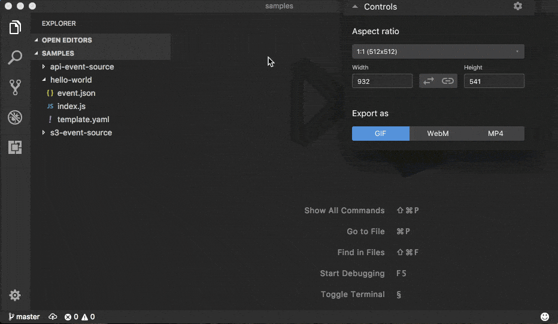

<p align="center">
  <a href="https://github.com/awslabs/aws-sam-cli" align="center">
    
  </a>
</p>

# SAM CLI

 **`sam`** is the AWS CLI tool for managing Serverless applications written with [AWS Serverless Application Model (SAM)](https://github.com/awslabs/serverless-application-model). SAM CLI can be used for testing functions locally, start a local API Gateway from a SAM template, validate a SAM template, and generate sample payloads for various event sources.

- [SAM CLI](#sam-cli)
    - [Main features](#main-features)
    - [Installation](#installation)
        - [Prerequisites](#prerequisites)
        - [OSX](#osx)
        - [Windows and Linux](#windows-and-linux)
        - [Build From Source](#build-from-source)
    - [Usage](#usage)
        - [Invoke functions locally](#invoke-functions-locally)
        - [Generate sample event source payloads](#generate-sample-event-source-payloads)
        - [Run API Gateway locally](#run-api-gateway-locally)
        - [Debugging Applications](#debugging-applications)
        - [Validate SAM templates](#validate-sam-templates)
    - [Getting started](#getting-started)
    - [Advanced](#advanced)
        - [IAM Credentials](#iam-credentials)
    - [Project Status](#project-status)
    - [Contributing](#contributing)
    - [Examples](#examples)
  
## Main features

* Develop and test your Lambda functions locally with `sam local` and Docker
* Invoke functions from known event sources such as Amazon S3, Amazon DynamoDB, Amazon Kinesis, etc.
* Start local API Gateway from a SAM template, and quickly iterate over your functions with hot-reloading
* Validate SAM templates

## Installation

### Prerequisites

Running Serverless projects and functions locally with SAM CLI requires Docker to be installed and running. SAM CLI will use the `DOCKER_HOST` environment variable to contact the docker daemon.

 - OSX: [Docker for Mac](http://docs.docker.com/docker-for-mac/install/)
 - Windows: [Docker Toolbox](https://download.docker.com/win/stable/DockerToolbox.exe)
 - Linux: Check your distro’s package manager (e.g. yum install docker)

Verify that docker is working, and that you can run docker commands from the CLI (e.g. ‘docker ps’). You do not need to install/fetch/pull any containers – SAM CLI will do it automatically as required. 

### OSX

The easiest way to install **`sam`** on OSX is to use [Homebrew](https://brew.sh/).

```bash
brew install aws-sam-cli
sam --version
```

### Windows and Linux

You can find latest releases under [Releases] in this repo. In case you cannot find the version or architecture you're looking for you can refer to [Build From Source] section for build details.

### Build From Source

First, install Go (v1.8+) on your machine: [https://golang.org/doc/install](https://golang.org/doc/install), then run the following:

```bash
$ go install github.com/awslabs/aws-sam-cli 
```

This will install **`sam`** to your `$GOPATH/bin` folder. Make sure this directory is in your `$PATH` (or %%PATH%% on Windows) and you should then be able to use the SAM CLI. Please note that due to the package name, the binary will be installed as `aws-sam-cli` rather than `sam`.

```bash
aws-sam-cli --help
```

## Usage

**`sam`** requires a SAM template in order to know how to invoke your function locally, and it's also true for spawning API Gateway locally - If no template is specified `template.yaml` will be used instead.

You can find sample SAM templates either under **`samples`** located in this repo or by visiting [SAM] official repository.

### Invoke functions locally



You can invoke your function locally by passing its **SAM logical ID** and an event file. Alternatively, `sam local invoke` accepts stdin as an event too.

```yaml
Resources: 
  Ratings:  # <-- Logical ID
    Type: 'AWS::Serverless::Function'
  ...
```

**Syntax**

```bash
# Invoking function with event file
$ sam local invoke "Ratings" -e event.json

# Invoking function with event via stdin
$ echo '{"message": "Hey, are you there?" }' | sam local invoke "Ratings"

# For more options
$ sam local invoke --help
```

### Generate sample event source payloads

To make local development and testing of Lambda functions easier, you can generate mock/sample event payloads for the following services:

* S3
* Kinesis
* DynamoDB
* Cloudwatch Scheduled Event
* Cloudtrail
* API Gateway

**Syntax**

```bash
sam local generate-event <service>
```

Also, you can invoke an individual lambda function locally from a sample event payload - Here's an example using S3:

```bash
sam local generate-event s3 --bucket <bucket> --key <key> | sam local invoke <function logical id>
```

For more options, see `sam local generate-event --help`.

### Run API Gateway locally

`sam local start-api` spawns a local API Gateway to test HTTP request/response functionality. Features hot-reloading to allow you to quickly develop, and iterate over your functions.


**Syntax**

```bash
sam local start-api
```

**`sam`** will automatically find any functions within your SAM template that have `Api` event sources defined, and mount them at the defined HTTP paths.

In the example below, the `Ratings` function would mount `ratings.py:handler()` at `/ratings` for `GET` requests.

```yaml
Ratings:
  Type: AWS::Serverless::Function
  Properties:
    Handler: ratings.handler
    Runtime: python3.6
    Events:
      Api:
        Type: Api
        Properties:
          Path: /ratings
          Method: get
```

### Debugging Applications

Both `sam local invoke` and `sam local start-api` support local debugging of your functions.

To run SAM CLI with debugging support enabled, just specify `--debug-port` or `-d` on the command line. 

```bash
# Invoke a function locally in debug mode on port 5858 
$ sam local invoke -d 5858 <function logical id> 

# Start local API Gateway in debug mode on port 5858
$ sam local start-api -d 5858
```

Note: If using `sam local start-api`, the local API Gateway will expose all of your lambda functions but, since you can specify a single debug port, you can only debug one function at a time.

Here is an example showing how to debug a NodeJS function with Microsoft Visual Studio Code:


In order to setup Visual Studio Code for debugging with AWS SAM CLI, use the following launch configuration:

```
{
    "version": "0.2.0",
    "configurations": [
        {
            "name": "Attach to SAM CLI",
            "type": "node",
            "request": "attach",
            "address": "localhost",
            "port": 5858,
            "localRoot": "${workspaceRoot}",
            "remoteRoot": "/var/task"
        }
    ]
}
``` 

> Notice: At the moment, debugging is only available for `java`, `nodejs4.3` and `nodejs.6.10` runtimes.

### Validate SAM templates

Validate your templates with `$ sam validate`.
This command will validate your template against the official [AWS Serverless Application Model specification](https://github.com/awslabs/serverless-application-model/blob/master/versions/2016-10-31.md).
As with most SAM CLI commands, it will look for a `template.yaml` file in your current working directory by default. You can specify a different template file/location with the `-t` or `--template` option.

**Syntax**

```bash
$ sam validate
ERROR: Resource "HelloWorld", property "Runtime": Invalid value node. Valid values are "nodejs", "nodejs4.3", "nodejs6.10", "java8", "python2.7", "python3.6", "dotnetcore1.0", "nodejs4.3-edge" (line: 11; col: 6)

# Let's fix that error...
$ sed -i 's/node/nodejs6.10/g' template.yaml

$ sam validate
Valid!
```

## Getting started

* Check out  section for more details

## Advanced

### IAM Credentials

SAM CLI will invoke functions with your locally configured IAM credentials.

As with the AWS CLI and SDKs, SAM CLI will look for credentials in the following order:

1. Environment Variables (`AWS_ACCESS_KEY_ID`, `AWS_SECRET_ACCESS_KEY`).
2. The AWS credentials file (located at `~/.aws/credentials` on Linux, macOS, or Unix, or at `C:\Users\USERNAME \.aws\credentials` on Windows).
3. Instance profile credentials (if running on Amazon EC2 with an assigned instance role).

See this [Configuring the AWS CLI](http://docs.aws.amazon.com/cli/latest/userguide/cli-chap-getting-started.html#config-settings-and-precedence) for more details.

## Project Status
  
* [ ] Supported AWS Lambda Runtimes
  - [x] `nodejs`
  - [x] `nodejs4.3`
  - [x] `nodejs6.10`
  - [ ] `java8`
  - [x] `python2.7`
  - [x] `python3.6`
  - [ ] `dotnetcore1.0`
* [x] AWS credential support 
* [x] Debugging support
* [ ] Inline Swagger support within SAM templates

## Contributing

> **FIXME - To be written**

## Examples

You can find sample functions code and a SAM template used in this README under the [samples] folder within this repo.

<!-- Links -->
[SAM]: https://github.com/awslabs/serverless-application-model
[HOWTO]: HOWTO.md
[Releases]: https://github.com/awslabs/aws-sam-cli/releases
[Samples]: https://github.com/awslabs/aws-sam-cli/tree/master/samples

