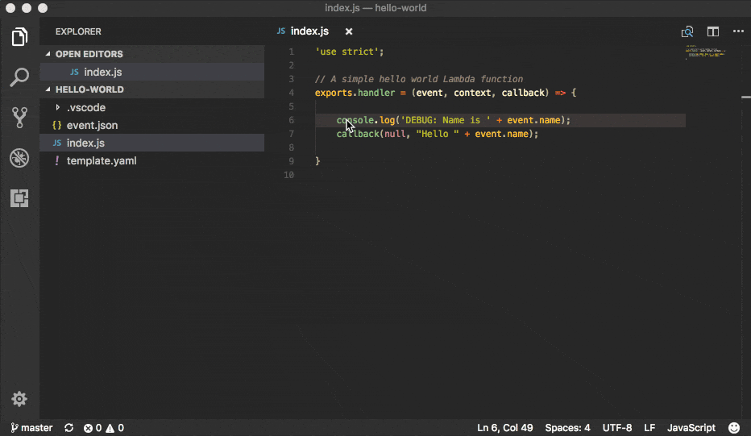

<p align="center">
  <a href="https://github.com/awslabs/aws-sam-local" align="center">
    
  </a>
</p>

# SAM Local (Beta)

[](https://travis-ci.org/awslabs/aws-sam-local)

 **`sam`** is the AWS CLI tool for managing Serverless applications written with [AWS Serverless Application Model (SAM)](https://github.com/awslabs/serverless-application-model). SAM Local can be used to test functions locally, start a local API Gateway from a SAM template, validate a SAM template, and generate sample payloads for various event sources.

- [SAM Local (Beta)](#sam-local-beta)
    - [Main features](#main-features)
    - [Installation](#installation)
        - [Prerequisites](#prerequisites)
        - [Windows, Linux, OSX with NPM [Recommended]](#windows-linux-osx-with-npm-recommended)
        - [Binary release](#binary-release)
        - [Build From Source](#build-from-source)
    - [Usage](#usage)
        - [Invoke functions locally](#invoke-functions-locally)
        - [Generate sample event source payloads](#generate-sample-event-source-payloads)
        - [Run API Gateway locally](#run-api-gateway-locally)
        - [Debugging Applications](#debugging-applications)
            - [Debugging Python functions](#debugging-python-functions)
        - [Validate SAM templates](#validate-sam-templates)
        - [Package and Deploy to Lambda](#package-and-deploy-to-lambda)
    - [Getting started](#getting-started)
    - [Advanced](#advanced)
        - [IAM Credentials](#iam-credentials)
        - [Lambda Environment Variables](#lambda-environment-variables)
            - [Environment Variable file](#environment-variable-file)
            - [Shell environment](#shell-environment)
            - [Combination of Shell and Environment Variable file](#combination-of-shell-and-environment-variable-file)
        - [Identifying local execution from Lambda function code](#identifying-local-execution-from-lambda-function-code)
        - [Local Logging](#local-logging)
        - [Remote Docker](#remote-docker)
    - [Project Status](#project-status)
    - [Contributing](#contributing)
    - [A special thank you](#a-special-thank-you)
    - [Examples](#examples)
  
## Main features

* Develop and test your Lambda functions locally with `sam local` and Docker
* Invoke functions from known event sources such as Amazon S3, Amazon DynamoDB, Amazon Kinesis, etc.
* Start local API Gateway from a SAM template, and quickly iterate over your functions with hot-reloading
* Validate SAM templates

## Installation

### Prerequisites

Running Serverless projects and functions locally with SAM Local requires Docker to be installed and running. SAM Local will use the `DOCKER_HOST` environment variable to contact the docker daemon.

 - OSX: [Docker for Mac](https://store.docker.com/editions/community/docker-ce-desktop-mac)
 - Windows: [Docker Toolbox](https://download.docker.com/win/stable/DockerToolbox.exe)
 - Linux: Check your distro’s package manager (e.g. yum install docker)

For OSX and Windows users: SAM local requires that the project directory (or any parent directory) is listed in Docker file sharing options.

Verify that docker is working, and that you can run docker commands from the CLI (e.g. ‘docker ps’). You do not need to install/fetch/pull any containers – SAM Local will do it automatically as required.


### Windows, Linux, OSX with NPM [Recommended]

The easiest way to install **`sam`** is to use [NPM](npmjs.com).

```bash
npm install -g aws-sam-local
```

Verify the installation worked:
```bash
sam --version
```

### Binary release

We also release the CLI as binaries that you can download and instantly use. You can find them under [Releases] in this repo. In case you cannot find the version or architecture you're looking for you can refer to [Build From Source](#build-from-source) section for build details.

### Build From Source

First, install Go (v1.8+) on your machine: [https://golang.org/doc/install](https://golang.org/doc/install), then run the following:

```bash
$ go get github.com/awslabs/aws-sam-local 
```

This will install **`sam`** to your `$GOPATH/bin` folder. Make sure this directory is in your `$PATH` (or %%PATH%% on Windows) and you should then be able to use the SAM Local. Please note that due to the package name, the binary will be installed as `aws-sam-local` rather than `sam`.

```bash
aws-sam-local --help
```

## Usage

**`sam`** requires a SAM template in order to know how to invoke your function locally, and it's also true for spawning API Gateway locally - If no template is specified `template.yaml` will be used instead.

You can find sample SAM templates either under **`samples`** located in this repo or by visiting [SAM] official repository.

### Invoke functions locally


You can invoke your function locally by passing its **SAM logical ID** and an event file. Alternatively, `sam local invoke` accepts stdin as an event too.

```yaml
Resources: 
  Ratings:  # <-- Logical ID
    Type: 'AWS::Serverless::Function'
  ...
```

**Syntax**

```bash
# Invoking function with event file
$ sam local invoke "Ratings" -e event.json

# Invoking function with event via stdin
$ echo '{"message": "Hey, are you there?" }' | sam local invoke "Ratings"

# For more options
$ sam local invoke --help
```

### Generate sample event source payloads

To make local development and testing of Lambda functions easier, you can generate mock/sample event payloads for the following services:

* S3
* Kinesis
* DynamoDB
* Cloudwatch Scheduled Event
* Cloudtrail
* API Gateway

**Syntax**

```bash
sam local generate-event <service>
```

Also, you can invoke an individual lambda function locally from a sample event payload - Here's an example using S3:

```bash
sam local generate-event s3 --bucket <bucket> --key <key> | sam local invoke <function logical id>
```

For more options, see `sam local generate-event --help`.

### Run API Gateway locally

`sam local start-api` spawns a local API Gateway to test HTTP request/response functionality. Features hot-reloading to allow you to quickly develop, and iterate over your functions.


**Syntax**

```bash
sam local start-api
```

**`sam`** will automatically find any functions within your SAM template that have `Api` event sources defined, and mount them at the defined HTTP paths.

In the example below, the `Ratings` function would mount `ratings.py:handler()` at `/ratings` for `GET` requests.

```yaml
Ratings:
  Type: AWS::Serverless::Function
  Properties:
    Handler: ratings.handler
    Runtime: python3.6
    Events:
      Api:
        Type: Api
        Properties:
          Path: /ratings
          Method: get
```

By default, SAM uses [Proxy Integration](http://docs.aws.amazon.com/apigateway/latest/developerguide/api-gateway-create-api-as-simple-proxy-for-lambda.html) and expects the response from your Lambda function to include one or more of the following: `statusCode`, `headers` and/or `body`.

For example:

```javascript
// Example of a Proxy Integration response
exports.handler = (event, context, callback) => {
    callback(null, {
        statusCode: 200,
        headers: { "x-custom-header" : "my custom header value" },
        body: "hello world"
    });
}
```

For examples in other AWS Lambda languages, see [this page](http://docs.aws.amazon.com/apigateway/latest/developerguide/api-gateway-create-api-as-simple-proxy-for-lambda.html).

If your function does not return a valid [Proxy Integration](http://docs.aws.amazon.com/apigateway/latest/developerguide/api-gateway-create-api-as-simple-proxy-for-lambda.html) response then you will get a HTTP 500 (Internal Server Error) when accessing your function. SAM Local will also print the following error log message to help you diagnose the problem:

```
ERROR: Function ExampleFunction returned an invalid response (must include one of: body, headers or statusCode in the response object)
```

### Debugging Applications

Both `sam local invoke` and `sam local start-api` support local debugging of your functions.

To run SAM Local with debugging support enabled, just specify `--debug-port` or `-d` on the command line. 

```bash
# Invoke a function locally in debug mode on port 5858 
$ sam local invoke -d 5858 <function logical id> 

# Start local API Gateway in debug mode on port 5858
$ sam local start-api -d 5858
```

Note: If using `sam local start-api`, the local API Gateway will expose all of your lambda functions but, since you can specify a single debug port, you can only debug one function at a time.

Here is an example showing how to debug a NodeJS function with Microsoft Visual Studio Code:



In order to setup Visual Studio Code for debugging with AWS SAM Local, use the following launch configuration:

```
{
    "version": "0.2.0",
    "configurations": [
        {
            "name": "Attach to SAM Local",
            "type": "node",
            "request": "attach",
            "address": "localhost",
            "port": 5858,
            "localRoot": "${workspaceRoot}",
            "remoteRoot": "/var/task"
        }
    ]
}
``` 

#### Debugging Python functions

Unlike Node.JS and Java, Python requires you to enable remote debugging in your Lambda function code. If you enable debugging with `--debug-port` or `-d` for a function that uses one of the Python runtimes, SAM Local will just map through that port from your host machine through to the Lambda runtime container. You will need to enable remote debugging in your function code. To do this, use a python package such as [remote-pdb](https://pypi.python.org/pypi/remote-pdb). When configuring the host the debugger listens on in your code, make sure to use `0.0.0.0` not `127.0.0.1` to allow Docker to map through the port to your host machine. 

### Validate SAM templates

Validate your templates with `$ sam validate`.
This command will validate your template against the official [AWS Serverless Application Model specification](https://github.com/awslabs/serverless-application-model/blob/master/versions/2016-10-31.md).
As with most SAM Local commands, it will look for a `template.yaml` file in your current working directory by default. You can specify a different template file/location with the `-t` or `--template` option.

**Syntax**

```bash
$ sam validate
ERROR: Resource "HelloWorld", property "Runtime": Invalid value node. Valid values are "nodejs", "nodejs4.3", "nodejs6.10", "java8", "python2.7", "python3.6", "dotnetcore1.0", "nodejs4.3-edge" (line: 11; col: 6)

# Let's fix that error...
$ sed -i 's/node/nodejs6.10/g' template.yaml

$ sam validate
Valid!
```

### Package and Deploy to Lambda
Once you have developed and tested your Serverless application locally, you can deploy to Lambda using `sam package` and `sam deploy` command. `package` command will zip your code artifacts, upload to S3 and produce a SAM file that is ready to be deployed to Lambda using AWS CloudFormation. `deploy` command will deploy the packaged SAM template to CloudFormation. Both `sam package` and `sam deploy` are identical to their AWS CLI equivalents commands [`aws cloudformation package`](http://docs.aws.amazon.com/cli/latest/reference/cloudformation/package.html) and [`aws cloudformation deploy`](http://docs.aws.amazon.com/cli/latest/reference/cloudformation/deploy/index.html) respectively. Please consult the AWS CLI command documentation for usage.

Example:

```bash
# Package SAM template
$ sam package --template-file sam.yaml --s3-bucket mybucket --output-template-file packaged.yaml

# Deploy packaged SAM template
$ sam deploy --template-file ./packaged.yaml --stack-name mystack --capabilities CAPABILITY_IAM
```


## Getting started

* Check out [HOWTO Guide](HOWTO.md) section for more details

## Advanced

### IAM Credentials

SAM Local will invoke functions with your locally configured IAM credentials.

As with the AWS CLI and SDKs, SAM Local will look for credentials in the following order:

1. Environment Variables (`AWS_ACCESS_KEY_ID`, `AWS_SECRET_ACCESS_KEY`).
2. The AWS credentials file (located at `~/.aws/credentials` on Linux, macOS, or Unix, or at `C:\Users\USERNAME \.aws\credentials` on Windows).
3. Instance profile credentials (if running on Amazon EC2 with an assigned instance role).

See this [Configuring the AWS CLI](http://docs.aws.amazon.com/cli/latest/userguide/cli-chap-getting-started.html#config-settings-and-precedence) for more details.

### Lambda Environment Variables
If your Lambda function uses environment variables, you can provide values for them will passed to the Docker container. Here is how you would do it:

For example, consider the SAM template snippet:

```yaml

Resources:
  MyFunction1:
    Type: AWS::Serverless::Function
    Properties:
      Handler: index.handler
      Runtime: nodejs4.3
      Environment:
        Variables:
          TABLE_NAME: prodtable
          BUCKET_NAME: prodbucket

  MyFunction2:
    Type: AWS::Serverless::Function
    Properties:
      Handler: app.handler
      Runtime: nodejs4.3
      Environment:
        Variables:
          STAGE: prod
          TABLE_NAME: prodtable


```

#### Environment Variable file
Use `--env-vars` argument of `invoke` or `start-api` commands to provide a JSON file that contains values for environment variables defined in your function. The file should be structured as follows:

```json
{
  "MyFunction1": {
    "TABLE_NAME": "localtable",
    "BUCKET_NAME": "testBucket"
  },
  "MyFunction2": {
    "TABLE_NAME": "localtable",
    "STAGE": "dev"
  },
}

```

```bash
$ sam local start-api --env-vars env.json
```

#### Shell environment 
Variables defined in your Shell's environment will be passed to the Docker container, if they map to a Variable in your Lambda function. Shell variables are globally applicable to functions ie. If two functions have a variable called `TABLE_NAME`, then the value for `TABLE_NAME` provided through Shell's environment will be availabe to both functions. 

Following command will make value of `mytable` available to both `MyFunction1` and `MyFunction2`

```bash
$ TABLE_NAME=mytable sam local start-api
```

#### Combination of Shell and Environment Variable file
For greater control, you can use a combination shell variables and external environment variable file. If a variable is defined in both places, the one from the file will override the shell. Here is the order of priority, highest to lowest. Higher priority ones will override the lower.

1. Environment Variable file
1. Shell's environment
1. Hard-coded values from the template

### Identifying local execution from Lambda function code
When your Lambda function is invoked using SAM Local, it sets an environment variable `AWS_SAM_LOCAL=true` in the Docker container. Your Lambda function can use this property to enable or disable functionality that would not make sense in local development. For example: Disable emitting metrics to CloudWatch (or) Enable verbose logging etc.

### Local Logging
Both `invoke` and `start-api` command allow you to pipe logs from the function's invocation into a file. This will be useful if you are running automated tests against SAM Local and want to capture logs for analysis. 

Example:
```bash
$ sam local invoke --log-file ./output.log
```


### Remote Docker
Sam Local loads function code by mounting filesystem to a Docker Volume. As a result, The project directory must be pre-mounted on the remote host where the Docker is running.

If mounted, you can use the remote docker normally using `--docker-volume-basedir` or environment variable `SAM_DOCKER_VOLUME_BASEDIR`.

Example - Docker Toolbox (Windows):

When you install and run Docker Toolbox, the Linux VM with Docker is automatically installed in the virtual box.

The /c/ path for this Linux VM is automatically shared with C:\ on the host machine.
```powershell
sam local invoke --docker-volume-basedir /c/Users/shlee322/projects/test "Ratings"
```


## Project Status
  
* [ ] Supported AWS Lambda Runtimes
  - [x] `nodejs`
  - [x] `nodejs4.3`
  - [x] `nodejs6.10`
  - [x] `java8`
  - [x] `python2.7`
  - [x] `python3.6`
  - [ ] `dotnetcore1.0`
* [x] AWS credential support 
* [x] Debugging support
* [ ] Inline Swagger support within SAM templates

## Contributing

Contributions and feedback are welcome! Proposals and pull requests will be considered and responded to. For more information, see the [CONTRIBUTING](CONTRIBUTING.md) file.

## A special thank you

SAM Local uses the open source [docker-lambda](https://github.com/lambci/docker-lambda) Docker images created by [@mhart](https://github.com/mhart). 

## Examples

You can find sample functions code and a SAM template used in this README under the [samples] folder within this repo.

<!-- Links -->
[SAM]: https://github.com/awslabs/serverless-application-model
[HOWTO]: HOWTO.md
[Releases]: https://github.com/awslabs/aws-sam-local/releases
[Samples]: https://github.com/awslabs/aws-sam-local/tree/master/samples

