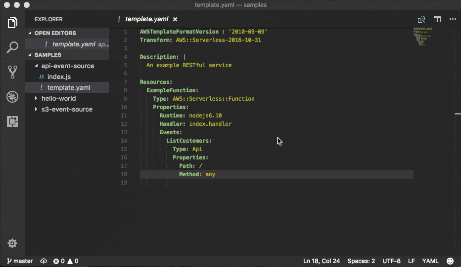
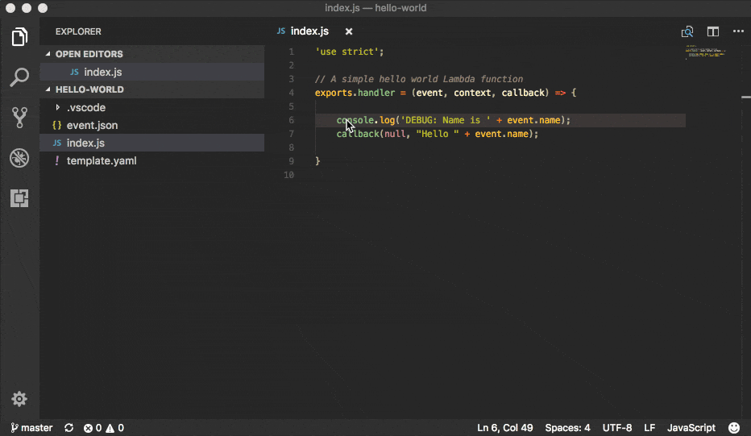

=====
Usage
=====

**Create a sample app with sam init command**: ``sam init`` or ``sam init --runtime <favourite-runtime>``

``sam`` requires a SAM template in order to know how to invoke your
function locally, and it’s also true for spawning API Gateway locally -
If no template is specified ``template.yaml`` will be used instead.

Alternatively, you can find other sample SAM Templates by visiting `SAM <https://github.com/awslabs/serverless-application-model>`__ official repository.

-  `Invoke functions locally <#invoke-functions-locally>`__
-  `Run automated tests for your Lambda functions locally <#run-automated-tests-for-your-lambda-functions-locally>`__
-  `Generate sample event source
   payloads <#generate-sample-event-payloads>`__
-  `Run API Gateway locally <#run-api-gateway-locally>`__
-  `Debugging Applications <#debugging-applications>`__

   -  `Debugging Python functions <#debugging-python-functions>`__
-  `Fetch, tail, and filter Lambda function logs <#fetch-tail-and-filter-lambda-function-logs>`__
-  `Validate SAM templates <#validate-sam-templates>`__
-  `Package and Deploy to
   Lambda <#package-and-deploy-to-lambda>`__

Invoke functions locally
------------------------

   SAM CLI Invoke Sample

You can invoke your function locally by passing its --SAM logical ID--
and an event file. Alternatively, ``sam local invoke`` accepts stdin as
an event too.

.. code:: yaml

   Resources:
     Ratings:  # <-- Logical ID
       Type: 'AWS::Serverless::Function'
     ...

**Syntax**

.. code:: bash

   # Invoking function with event file
   $ sam local invoke "Ratings" -e event.json

   # Invoking function with event via stdin
   $ echo '{"message": "Hey, are you there?" }' | sam local invoke "Ratings"

   # For more options
   $ sam local invoke --help

Run automated tests for your Lambda functions locally
-----------------------------------------------------
You can use the ``sam local invoke`` command to manually test your code
by running Lambda function locally. With SAM CLI, you can easily
author automated integration tests by
first running tests against local Lambda functions before deploying to the
cloud. The ``sam local start-lambda`` command starts a local
endpoint that emulates the AWS Lambda service’s invoke endpoint, and you
can invoke it from your automated tests. Because this endpoint emulates
the Lambda service's invoke endpoint, you can write tests once and run
them (without any modifications) against the local Lambda function or
against a deployed Lambda function. You can also run the same tests
against a deployed SAM stack in your CI/CD pipeline.

Here is how this works:

**1. Start the Local Lambda Endpoint**

Start the local Lambda endpoint by running the following command in the directory that contains your AWS
SAM template:

.. code:: bash

   sam local start-lambda

This command starts a local endpoint at http://127.0.0.1:3001 that
emulates the AWS Lambda service, and you can run your automated tests
against this local Lambda endpoint. When you send an invoke to this
endpoint using the AWS CLI or SDK, it will locally execute the Lambda
function specified in the request and return a response.

**2. Run integration test against local Lambda endpoint**

In your integration test, you can use AWS SDK to invoke your Lambda function
with test data, wait for response, and assert that the response what you
expect. To run the integration test locally, you should configure AWS
SDK to send Lambda Invoke API call to local Lambda endpoint started in
previous step.

Here is an Python example (AWS SDK for other languages have similar
configurations):

.. code:: python

   import boto3
   import botocore

   # Set "running_locally" flag if you are running the integration test locally
   running_locally = True

   if running_locally:

       # Create Lambda SDK client to connect to appropriate Lambda endpoint
       lambda_client = boto3.client('lambda',
           region_name="us-west-2",
           endpoint_url="http://127.0.0.1:3001",
           use_ssl=False,
           verify=False,
           config=botocore.client.Config(
               signature_version=botocore.UNSIGNED,
               read_timeout=0,
               retries={'max_attempts': 0},
           )
       )
   else:
       lambda_client = boto3.client('lambda')

   # Invoke your Lambda function as you normally usually do. The function will run
   # locally if it is configured to do so
   response = lambda_client.invoke(FunctionName="HelloWorldFunction")

   # Verify the response
   assert response == "Hello World"

This code can run without modifications against a Lambda function which
is deployed. To do so, set the ``running_locally`` flag to ``False`` .
This will setup AWS SDK to connect to AWS Lambda service on the cloud.

Connecting to docker network
----------------------------

Both ``sam local invoke`` and ``sam local start-api`` support connecting
the create lambda docker containers to an existing docker network.

To connect the containers to an existing docker network, you can use the
``--docker-network`` command-line argument or the ``SAM_DOCKER_NETWORK``
environment variable along with the name or id of the docker network you
wish to connect to.

.. code:: bash

   # Invoke a function locally and connect to a docker network
   $ sam local invoke --docker-network my-custom-network <function logical id>

   # Start local API Gateway and connect all containers to a docker network
   $ sam local start-api --docker-network b91847306671 -d 5858

Generate sample event payloads
------------------------------

To make local development and testing of Lambda functions easier, you
can generate and customize event payloads for the following services:

- Amazon Alexa
- Amazon API Gateway
- AWS Batch
- AWS CloudFormation
- Amazon CloudFront
- AWS CodeCommit
- AWS CodePipeline
- Amazon Cognito
- AWS Config
- Amazon DynamoDB
- Amazon Kinesis
- Amazon Lex
- Amazon Rekognition
- Amazon S3
- Amazon SES
- Amazon SNS
- Amazon SQS
- AWS Step Functions

**Syntax**

.. code:: bash

  $ sam local generate-event <service> <event>

You can generate multiple types of events from each service. For example,
to generate the event from S3 when a new object is created, use:

.. code:: bash

  $ sam local generate-event s3 put

To generate the event from S3 when an object is deleted, you can use:

.. code:: bash

  $ sam local generate-event s3 delete

For more options, see ``sam local generate-event --help``.

Run API Gateway locally
-----------------------

``sam local start-api`` spawns a local API Gateway to test HTTP
request/response functionality. Features hot-reloading to allow you to
quickly develop and iterate over your functions.

   SAM CLI Start API

**Syntax**

.. code:: bash

   $ sam local start-api

``sam`` will automatically find any functions within your SAM
template that have ``Api`` event sources defined, and mount them at the
defined HTTP paths.

In the example below, the ``Ratings`` function would mount
``ratings.py:handler()`` at ``/ratings`` for ``GET`` requests.

.. code:: yaml

   Ratings:
     Type: AWS::Serverless::Function
     Properties:
       Handler: ratings.handler
       Runtime: python3.6
       Events:
         Api:
           Type: Api
           Properties:
             Path: /ratings
             Method: get

By default, SAM uses `Proxy
Integration <http://docs.aws.amazon.com/apigateway/latest/developerguide/api-gateway-create-api-as-simple-proxy-for-lambda.html>`__
and expects the response from your Lambda function to include one or
more of the following: ``statusCode``, ``headers`` and/or ``body``.

For example:

.. code:: javascript

   // Example of a Proxy Integration response
   exports.handler = (event, context, callback) => {
       callback(null, {
           statusCode: 200,
           headers: { "x-custom-header" : "my custom header value" },
           body: "hello world"
       });
   }

For examples in other AWS Lambda languages, see `this
page <http://docs.aws.amazon.com/apigateway/latest/developerguide/api-gateway-create-api-as-simple-proxy-for-lambda.html>`__.

If your function does not return a valid `Proxy
Integration <http://docs.aws.amazon.com/apigateway/latest/developerguide/api-gateway-create-api-as-simple-proxy-for-lambda.html>`__
response then you will get a HTTP 500 (Internal Server Error) when
accessing your function. SAM CLI will also print the following error log
message to help you diagnose the problem:

::

   ERROR: Function ExampleFunction returned an invalid response (must include one of: body, headers or statusCode in the response object)

Debugging Applications
----------------------

Both ``sam local invoke`` and ``sam local start-api`` support local
debugging of your functions.

To run SAM Local with debugging support enabled, just specify
``--debug-port`` or ``-d`` on the command line. SAM CLI debug port option ``--debug-port`` or ``-d`` will map that port to the local Lambda container execution your IDE needs to connect to.

.. code:: bash

   # Invoke a function locally in debug mode on port 5858
   $ sam local invoke -d 5858 <function logical id>

   # Start local API Gateway in debug mode on port 5858
   $ sam local start-api -d 5858

Note: If using ``sam local start-api``, the local API Gateway will
expose all of your Lambda functions but, since you can specify a single
debug port, you can only debug one function at a time. You will need to
hit your API before SAM CLI binds to the port allowing the debugger to
connect.

Here is an example showing how to debug a NodeJS function with Microsoft
Visual Studio Code:

   SAM Local debugging example

In order to setup Visual Studio Code for debugging with AWS SAM CLI, use
the following launch configuration after setting directory where the template.yaml is present
as workspace root in Visual Studio Code:

.. code:: json

  {
       "version": "0.2.0",
       "configurations": [
           {
               "name": "Attach to SAM CLI",
               "type": "node",
               "request": "attach",
               "address": "localhost",
               "port": 5858,
               // From the sam init example, it would be "${workspaceRoot}/hello_world"
               "localRoot": "${workspaceRoot}/{directory of node app}",
               "remoteRoot": "/var/task",
               "protocol": "inspector",
               "stopOnEntry": false
           }
       ]
   }

Note: localRoot is set based on what the CodeUri points at template.yaml,
if there are nested directories within the CodeUri, that needs to be
reflected in localRoot.

Note: Node.js versions --below-- 7 (e.g. Node.js 4.3 and Node.js 6.10)
use the ``legacy`` protocol, while Node.js versions including and above
7 (e.g. Node.js 8.10) use the ``inspector`` protocol. Be sure to specify
the corresponding protocol in the ``protocol`` entry of your launch
configuration. This was tested with VS code version 1.26, 1.27 and 1.28
for ``legacy`` and ``inspector`` protocol.

Debugging Python functions
--------------------------

Python debugging requires you to enable remote debugging in your Lambda function code, therefore it's a 2-step process:

1. Install `ptvsd <https://pypi.org/project/ptvsd/>`__ library and enable within your code
2. Configure your IDE to connect to the debugger you configured for your function

As this may be your first time using SAM CLI, let's start with a boilerplate Python app and install both app's dependencies and ptvsd:

.. code:: bash

    sam init --runtime python3.6 --name python-debugging
    cd python-debugging/
    
    # Install dependencies of our boilerplate app
    pip install -r requirements.txt -t hello_world/build/
    
    # Install ptvsd library for step through debugging
    pip install ptvsd -t hello_world/build/
    
    cp hello_world/app.py hello_world/build/

Ptvsd configuration
^^^^^^^^^^^^^^^^^^^

As we installed ptvsd library in the previous step, we need to enable ptvsd within our code, therefore open up ``hello_world/build/app.py`` and add the following ptvsd specifics.

.. code:: python

  import ptvsd
  
  # Enable ptvsd on 0.0.0.0 address and on port 5890 that we'll connect later with our IDE
  ptvsd.enable_attach(address=('0.0.0.0', 5890), redirect_output=True)
  ptvsd.wait_for_attach()

**0.0.0.0** instead of **localhost** for listening across all network interfaces and **5890** is the debugging port of your preference.

Visual Studio Code
^^^^^^^^^^^^^^^^^^

Now that we have both dependencies and ptvsd enabled within our code we configure Visual Studio Code (VS Code) Debugging - Assuming you're still in the application folder and have code command in your path, let's open up VS Code:

.. code:: bash

    code .

``NOTE``: If you don't have code in your Path, please open up a new instance of VS Code from ``python-debugging/`` folder we created earlier.

In order to setup VS Code for debugging with AWS SAM CLI, use
the following launch configuration:

.. code:: json

   {
       "version": "0.2.0",
       "configurations": [
           {
              "name": "SAM CLI Python Hello World",
              "type": "python",
              "request": "attach",
              "port": 5890,
              "host": "localhost",
              "pathMappings": [
                  {
                      "localRoot": "${workspaceFolder}/hello_world/build",
                      "remoteRoot": "/var/task"
                  }
              ]
          }
      ]
    }

For VS Code, the property **localRoot** under **pathMappings** key is really important and there are 2 aspects you should know as to why this is setup this way:

1. **localRoot**: This path will be mounted in the Docker Container and needs to have both application and dependencies at the root level
2. **workspaceFolder**: This path is the absolute path where VS Code instance was opened

If you opened VS Code in a different location other than ``python-debugging/`` you need to replace it with the absolute path where ``python-debugging/`` is.

Once complete with VS Code Debugger configuration, make sure to add a breakpoint anywhere you like in ``hello_world/build/app.py`` and then proceed as follows:

1. Run SAM CLI to invoke your function
2. Hit the URL to invoke the function and initialize ptvsd code execution
3. Start the debugger within VS Code

.. code:: bash

  # Remember to hit the URL before starting the debugger in VS Code

  sam local start-api -d 5890

  # OR 

  # Change HelloWorldFunction to reflect the logical name found in template.yaml

  sam local generate-event apigateway aws-proxy | sam local invoke HelloWorldFunction -d 5890

Debugging Golang functions
--------------------------

Golang function debugging is slightly different when compared to Node.JS,
Java, and Python. We require `delve <https://github.com/derekparker/delve>`__
as the debugger, and wrap your function with it at runtime. The debugger
is run in headless mode, listening on the debug port.

When debugging, you must compile your function in debug mode:

``GOARCH=amd64 GOOS=linux go build -gcflags='-N -l' -o <output path> <path to code directory>``

You must compile `delve` to run in the container and provide its local path
via the `--debugger-path` argument. Build delve locally as follows:

``GOARCH=amd64 GOOS=linux go build -o <delve folder path>/dlv github.com/derekparker/delve/cmd/dlv``

NOTE: The output path needs to end in `/dlv`. The docker container will expect the dlv binary to be in the <delve folder path>
and will cause mounting issue otherwise.

Then invoke `sam` similar to the following:

``sam local start-api -d 5986 --debugger-path <delve folder path>``

NOTE: The ``--debugger-path`` is the path to the directory that contains the `dlv` binary compiled from the above.

The following is an example launch configuration for Visual Studio Code to
attach to a debug session.

.. code:: json

  {
    "version": "0.2.0",
    "configurations": [
    {
        "name": "Connect to Lambda container",
        "type": "go",
        "request": "launch",
        "mode": "remote",
        "remotePath": "",
        "port": <debug port>,
        "host": "127.0.0.1",
        "program": "${workspaceRoot}",
        "env": {},
        "args": [],
      },
    ]
  }

Passing Additional Runtime Debug Arguments
------------------------------------------

To pass additional runtime arguments when debugging your function, use
the environment variable ``DEBUGGER_ARGS``. This will pass a string
of arguments directly into the run command SAM CLI uses to start your
function.

For example, if you want to load a debugger like iKPdb at runtime of
your Python function, you could pass the following as
``DEBUGGER_ARGS``:
``-m ikpdb --ikpdb-port=5858 --ikpdb-working-directory=/var/task/ --ikpdb-client-working-directory=/myApp --ikpdb-address=0.0.0.0``.
This would load iKPdb at runtime with the other arguments you’ve
specified. In this case, your full SAM CLI command would be:

.. code:: bash

   $ DEBUGGER_ARGS="-m ikpdb --ikpdb-port=5858 --ikpdb-working-directory=/var/task/ --ikpdb-client-working-directory=/myApp --ikpdb-address=0.0.0.0" echo {} | sam local invoke -d 5858 myFunction

You may pass debugger arguments to functions of all runtimes.

To simplify troubleshooting, we added a new command called ``sam logs``
to SAM CLI. ``sam logs`` lets you fetch logs generated by your Lambda
function from the command line. In addition to printing the logs on the
terminal, this command has several nifty features to help you quickly
find the bug. Note: This command works for all AWS Lambda functions; not
just the ones you deploy using SAM.

Fetch, tail, and filter Lambda function logs
--------------------------------------------
To simplify troubleshooting, SAM CLI has a command called ``sam logs``.
``sam logs`` lets you fetch logs generated by your Lambda
function from the command line. In addition to printing the logs on the
terminal, this command has several nifty features to help you quickly
find the bug.

Note: This command works for all AWS Lambda functions; not
just the ones you deploy using SAM.

**Basic Usage: Using CloudFormation Stack**

When your function is a part
of a CloudFormation stack, you can fetch logs using the function's
LogicalID:

.. code:: bash

   sam logs -n HelloWorldFunction --stack-name mystack

**Basic Usage: Using Lambda Function name**

Or, you can fetch logs using the function's name

.. code:: bash

   sam logs -n mystack-HelloWorldFunction-1FJ8PD

**Tail Logs**

Add ``--tail`` option to wait for new logs and see them as
they arrive. This is very handy during deployment or when
troubleshooting a production issue.

.. code:: bash

   sam logs -n HelloWorldFunction --stack-name mystack --tail

**View logs for specific time range**
You can view logs for specific time range using the ``-s`` and ``-e`` options

.. code:: bash

   sam logs -n HelloWorldFunction --stack-name mystack -s '10min ago' -e '2min ago'

**Filter Logs**

Use the ``--filter`` option to quickly find logs that
match terms, phrases or values in your log events

.. code:: bash

   sam logs -n HelloWorldFunction --stack-name mystack --filter "error"

In the output, SAM CLI will underline all occurrences of the word
“error” so you can easily locate the filter keyword within the log
output.

**Error Highlighting**

When your Lambda function crashes or times out,
SAM CLI will highlight the timeout message in red. This will help you
easily locate specific executions that are timing out within a giant
stream of log output.

.. figure:: https://user-images.githubusercontent.com/22755571/42301038-3363a366-7fc8-11e8-9d0e-308b209cb92b.png
   :alt: SAM CLI Logs Error Highlighting

**JSON pretty printing**

If your log messages print JSON strings, SAM
CLI will automatically pretty print the JSON to help you visually parse
and understand the JSON.

.. figure:: https://user-images.githubusercontent.com/22755571/42301064-50c6cffa-7fc8-11e8-8f31-04ef117a9c5a.png
   :alt: SAM CLI Logs JSON Pretty Print

Validate SAM templates
----------------------

Validate your templates with ``$ sam validate``. Currently this command
will validate that the template provided is valid JSON / YAML. As with
most SAM CLI commands, it will look for a ``template.[yaml|yml]`` file
in your current working directory by default. You can specify a
different template file/location with the ``-t`` or ``--template``
option.

**Syntax**

.. code:: bash

   $ sam validate
   <path-to-file>/template.yml is a valid SAM Template

Note: The validate command requires AWS credentials to be configured. See `IAM Credentials <#iam-credentials>`__.

Package and Deploy to Lambda
----------------------------

Once you have developed and tested your Serverless application locally,
you can deploy to Lambda using ``sam package`` and ``sam deploy``
command.

``sam package`` command will zip your code artifacts, upload to S3
and produce a SAM file that is ready to be deployed to Lambda using AWS
CloudFormation.

``sam deploy`` command will deploy the packaged SAM template
to CloudFormation.

Both ``sam package`` and ``sam deploy`` are identical
to their AWS CLI equivalents commands
`aws cloudformation package <http://docs.aws.amazon.com/cli/latest/reference/cloudformation/package.html>`__
and
`aws cloudformation deploy <http://docs.aws.amazon.com/cli/latest/reference/cloudformation/deploy/index.html>`__
respectively - Please consult the AWS CLI command documentation for usage.

Example:

.. code:: bash

   # Package SAM template
   $ sam package --template-file sam.yaml --s3-bucket mybucket --output-template-file packaged.yaml

   # Deploy packaged SAM template
   $ sam deploy --template-file ./packaged.yaml --stack-name mystack --capabilities CAPABILITY_IAM

Learn More
----------

-  `Project Overview <../README.rst>`__
-  `Installation <installation.rst>`__
-  `Getting started with SAM and the SAM CLI <getting_started.rst>`__
-  `Packaging and deploying your application <deploying_serverless_applications.rst>`__
-  `Advanced <advanced_usage.rst>`__
