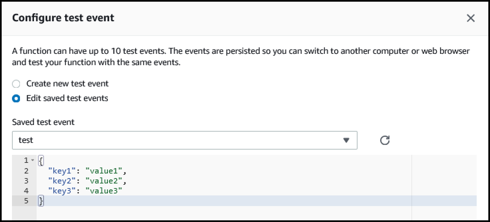
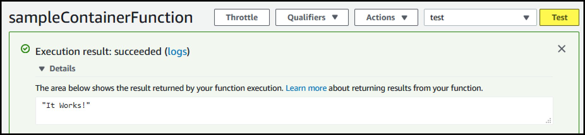

Lambda Function from Container
==============================


* AWS announced at [re:Invent 2020 that Lambda Functions could now be deployed from Containers](https://aws.amazon.com/blogs/aws/new-for-aws-lambda-container-image-support/)

* Provisioning A Lambda function from a Container allows the establishment of a standardized Container-based build, and deployment, pipeline.

* Lambda functions with large sets of dependencies will can be easier to package and deploy as a Container.


* The **Container Image** is defined in `app.py`. 
  * If `use_pre_existing_image` is **True**, then it is expected that a **Container Image** was **created elsewhere** and will be used by this CDK code.
  * If `use_pre_existing_image` is **False**, then a new container will be created using the `Dockerfile` from the the `lambda-image` sub-directory.

* After deploying the **Lambda Function**, go to the **Lambda Dashboard**, open the **Lambda Function**, and **configure a test event**.



* After running the **test event**, the **output** should be from the **Lambda Function code** compiled in to the **Container Image**.




## Deploy using CDK


### Install CDK

* **cdk** is a **NodeJS** app.
* Install NodeJS.
* Use `npm` to install `cdk`

```bash
sudo npm install -g --force cdk
```


### Create Python Virtual Environment

```bash
python3 -m venv .venv
source .venv/bin/activate
```


### Install Python-specific modules

* Each service such as **lambda** _(`aws_cdk.aws_lambda`)_ or **ec2** _(`aws_cdk.aws_ec2`)_, has its own module which must be defined in `requirements.txt`.

```bash
pip3 install -r requirements.txt
```


### Create Cloudformation from CDK

```bash
cdk synth
```


#### View the generated Cloudformation

```bash
cat cdk.out/LambdaContainerFunctionStack.template.json
```


### Deploy

```bash
cdk deploy
```


